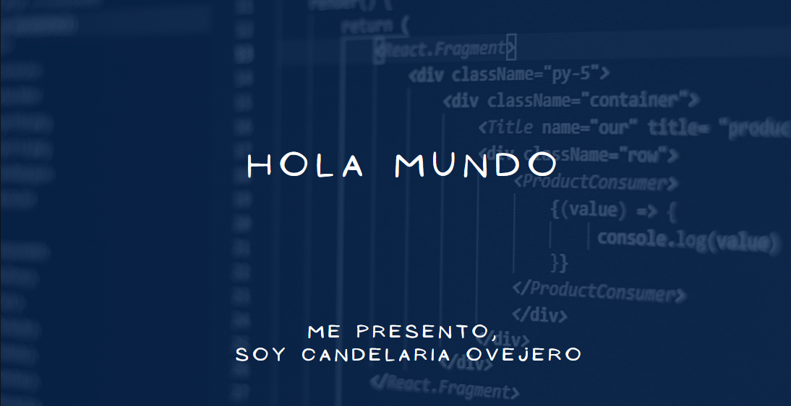

 
<h1 align="center">Bienvenidxs a mi github💫</h1>

  
<h3>🧿Les cuento un poco sobre mi !</h3>
  
  
 
  Soy Desarrolladora Web Full Stack☄️  
 Lo que me atrae de la programacion es la logica que hay detras de cualquier lenguaje, y a partir de ahi poder crear infinitas convinaciones (respetando las reglas de lo que uses)🫐

<h3 align="left">Lenguajes y Herramientas que fui aprendiendo:</h3>

   

 
 
 

 
 
 

 

&nbsp;

 

## :paperclip: How to reach me:

<a href="https://www.linkedin.com/in/candelaria-ovejero-9802a9157/" > &nbsp;
<a href="mailto:ovejerocande@gmail.com" >

  💌 Puedes contactarme aquí: ⤵️

  

  

